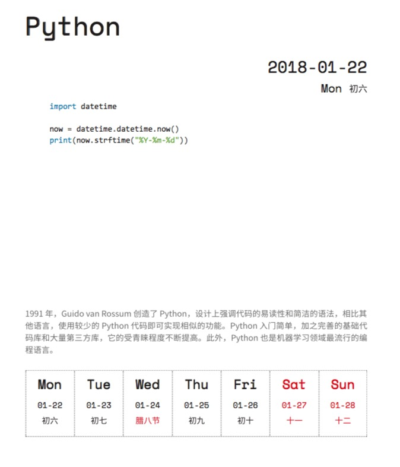

# Mac命令行壁纸（Mac command wallpaper）

## 命令格式

`wallpaper [para1] [para2] [para3]`

## v2.0更新内容

> 为了更方便的使用壁纸切换的命令，做到最精简，出了`Alfred`版本，即`Mac-wallpaper-switcher`。
>
> **效果如下**

> [Mac-wallpaper-switcher 下载地址](https://github.com/xiaobocser/Mac-command-wallpaper/releases/tag/v2.0)
>
> 而且，`基础功能`中的很多代码进行了重写，为了保证`无需配置的Mac`可以正常使用，通用性更好。
>
> 当然，如果您不需要`Alfred`的`workflow`功能，那么可以继续`更愉快`的使用基础功能 ^ ^

## 基础功能

1. 设定所选图片为壁纸

      `wallpaper YOUR_WALLPAPAER_PATH`

2. 随机网络壁纸（几乎没有重复）

      `wallpaper randweb`

3. 随机本地壁纸

    `wallpaper randlocal`

      > 随机壁纸目录为./background

4. 2018年编程日历壁纸

    > 如图

    

    ### 简介

    > 拿任何一张你喜欢的`背景图片`和`编程日历`合二为一，生成你的独特桌面背景

    > `编程日历`每周一更；`背景图片`随你所动。

    

    **命令:**

      `wallpaper [para1] com [para3]`

    >  [para1] 可以使用上面1、2、3命令的参数

    > [para3] 0-52整数，代表从这周开始算，生成[para3]周前的编程日历

    *举例:*

     `wallpaper randweb com`

    > 从网络上随机下载壁纸，并生成本周编程日历做壁纸 

     `wallpaper YOUR_WALLPAPAER_PATH com 3`

    > 将你指定的壁纸(建议2560x1600分辨率)，生成3周前的编程日历做壁纸

    *高级用法:*

    > 每周定时生成编程日历壁纸

     `crontab -e`

     `0 12 * * 1 /bin/bash $FILE_PATH/wallpaper randweb com` 

    > 每周一中午12点自动从网络随机挑选生成编程日历并作为壁纸

5. 命令提示

	  `wallpaper --h`

6. 原生

    > 如果不使用编程日历功能，全部通过mac的原生命令行完成，无需其它编译安装。

7. 和alfred、launchBar更配哦

## 安装

1. `git clone https://github.com/xiaobocser/Mac-command-wallpaper.git`

2. `bash install.sh`

3. 新建窗口并尝试执行 `wallpaper`

--------------------

> ** 如果不使用2018年编程日历壁纸的功能，安装到这里就可以了。需要的同学请进行`依赖安装` **

## 编程日历壁纸功能---依赖安装

> 打开`终端`程序

1. 安装homebrew

	  `/usr/bin/ruby -e "$(curl -fsSL https://raw.githubusercontent.com/Homebrew/install/master/install)"`

2. 安装python

      `brew install python`

3. 安装wand包

    `pip install wand`

4. 安装ImageMagick

      `brew install imagemagick@6`

      `export MAGICK_HOME=/usr/local/opt/imagemagick@6`

      `pip install PyPDF2`

5. 安装Ghostscript

      `brew install ghostscript`

6. 再次运行`install.sh`

      `bash install.sh`

## 感谢

> V2EX: https://www.v2ex.com/t/427092

> wallhaven: https://alpha.wallhaven.cc/
